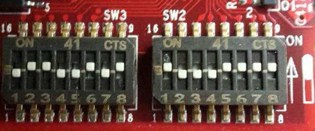

Let's boot
==========

Make sure that @board@ boot mode jumpers are set like in the following picture:

Insert the SD card you just prepared inside socket **J18**.

Set the jumpers **J20** and **J19** pin2-3:

.. image:: _static/sdcard-jumpers2.jpg
    :align: center

Connect the power supply cable to PWR JACK J3.

Connect the mini-USB cable from your PC to @board@ USB connector.

And now proceed by setting up the serial console.

.. include:: serial_console.rst

Give *root* to the login prompt:

.. board::

 | @machine-name@ login: root

and press *Enter*.

.. note::

 Sometimes, the time you spend setting up minicom makes you miss all the output that leads to the login and you see just a black screen, press *Enter* then to get the login prompt.

