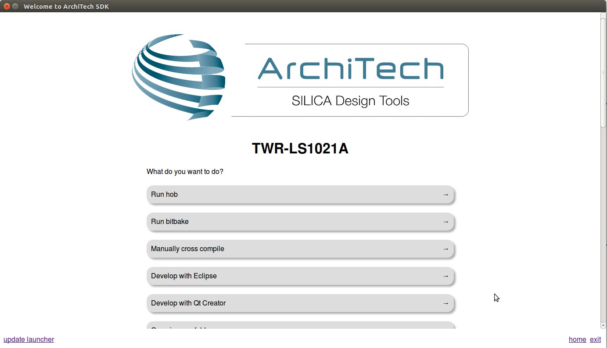

VM content
==========

The virtual machine provided by Architech contains:

* A splash screen, used to easily interact with the boards tools

* Yocto/OpenEmbedded toolchain to build BSPs and file systems

* A cross-toolchain (derived from Yocto/OpenEmbedded) for all the boards

All the aforementioned tools are installed under directory **/home/@user@/architech_sdk**,
its sub-directories main layout is the following:

.. host::

 | architech_sdk
 |     |
 |     |_ splashscreen
 |     |
 |     |_ spashscreen-interface
 |     |
 |     |_ architech-manifest
 |     |
 |     |_ architech
 |         |
 |         |_ ...
 |         |
 |         |_ @board-alias@
 |             |
 |             |_ splashscreen
 |             |
 |             |_ sysroot
 |             |
 |             |_ toolchain
 |             |
 |             |_ yocto
 |                 |
 |                 |_ build_ls1021atwr_release
 |                 |
 |                 |_ poky
 |                 |
 |                 |_ @meta-layer@
 |                 |
 |                 |_ ...

**@board-alias@** directory contains all the tools composing the ArchiTech SDK for @board@ board,
along with all the information needed by the splash screen application. In particular:

* *splashscreen* directory contains information and scripts used by the splash screen application,
* *sysroot* is supposed to contain the file system you want to compile against,
* *toolchain* is where the cross-toolchain has been installed installed
* *yocto* is where you find all the meta-layers @board@ requires, along with Poky and the build directory

Splash screen
-------------

The splash screen application has been designed to facilitate the access to the boards tools.
It can be opened by clicking on its *Desktop* icon.

.. image:: _static/splashscreen-icon.png
    :align: center   

Once started, you can can choose if you want to work with Architech's boards or with partners'
ones. For @board@, choose **ArchiTech**.

.. image:: _static/splash1.jpg
    :align: center

A list of all available Architech's boards will open, select **@board@**.

A list of actions related to **@board@** that can be activated will appear.

